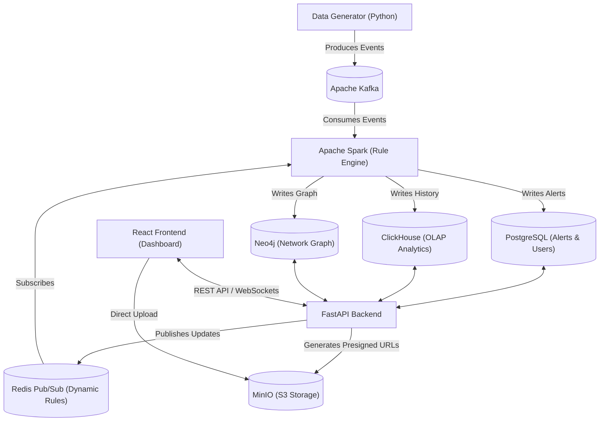

# 🏦 Real-time Banking Data Platform & Fraud Detection System

A real-time banking data platform featuring a comprehensive Fraud Detection Engine, Anti-Money Laundering (AML) analysis, and a Security Dashboard tailored for investigators.

This project is built on a **Big Data / Event-Driven** architecture, utilizing real-time data streaming and multiple specialized databases to achieve high performance.

## ✨ Key Features

1. **🚀 Real-time Fraud Engine**: Simulates and processes thousands of transactions per second through Apache Kafka and Spark Structured Streaming.
2. **🧠 XAI (Explainable AI)**: Automatically evaluates Risk Scores and provides transparent, human-readable explanations for flagged transactions (e.g., "Detected circular money transfer loop").
3. **⚙️ Dynamic Rule Management**: Administrators can add, modify alert thresholds, or toggle fraud rules directly from the UI without restarting the system (powered by Redis Pub/Sub).
4. **🌐 KYC 360° View**: A comprehensive customer profile. Integrates Neo4j to visualize the transaction network graph, helping investigators identify complex money laundering rings.
5. **🕵️ Case Investigation**: A Case Management system that allows security investigators to assign tasks, leave investigation notes, and securely upload evidence files via MinIO (S3-compatible).
6. **📊 Analytics & Insights**: Advanced charts including Sankey diagrams (money flow), Scatter Plots (anomaly detection), and transaction conversion funnels.

## 🏗 System Architecture

The platform follows a robust event-driven microservices architecture:



## 💻 Tech Stack

The system utilizes a modern technology stack fully containerized with Docker.

* **Frontend**: React.js, Recharts (Data Visualization), React-Force-Graph (Network Graph), Lucide Icons.
* **Backend**: FastAPI (Python), Boto3, Redis Pub/Sub.
* **Streaming Engine**: Apache Kafka, Apache Spark (PySpark).
* **Databases & Storage**:
  * **PostgreSQL**: Stores user data, Alerts, Case management state, and Rules.
  * **ClickHouse**: High-performance OLAP Database for transaction history and Analytics.
  * **Neo4j**: Graph Database specialized in querying network relationships (for AML).
  * **Redis**: Caching and Pub/Sub Message Broker for the Rule Engine.
  * **MinIO**: S3-compatible Object Storage for saving evidence files (PDFs/Images).

## 🚀 Setup & Installation

### 1. Prerequisites
* Docker and Docker Compose installed.
* At least 8GB of RAM (16GB recommended due to running multiple databases and Spark).

### 2. Start the System

Clone the repository and run the following command at the project root directory:

```bash
docker compose up -d
```

The initial startup may take a few minutes to pull images and initialize databases. The following containers will be launched:
- `banking_kafka`, `banking_zookeeper`
- `banking_postgres`, `banking_clickhouse`, `banking_neo4j`, `banking_redis`, `banking_minio`
- `banking_spark_master`, `banking_spark_worker`
- `banking_dashboard_backend`, `banking_dashboard_frontend`

### 3. Accessing Services

Once all containers transition to the *Running* state, you can access the following interfaces:

* **Dashboard Web UI**: [http://localhost:5173](http://localhost:5173)
* **Backend API Docs**: [http://localhost:8000/docs](http://localhost:8000/docs)
* **MinIO Console**: [http://localhost:9001](http://localhost:9001)
* **Neo4j Browser**: [http://localhost:7474](http://localhost:7474)

## 📁 Directory Structure

```text
banking_data_platform/
├── dashboard/
│   ├── backend/               # FastAPI Server, APIs, Database Connections
│   │   ├── main.py            # Backend Entry point
│   │   └── sql/               # Init scripts for Postgres, Clickhouse
│   └── frontend/              # React UI Application
│       ├── src/
│       │   ├── components/    # Tabs (Security, Analytics, Rules, KYC...)
│       │   └── index.css      # Custom UI styling
├── data_generator/            # Script generating fake transactions to Kafka
├── docker/                    # init.sql scripts for DB startup
├── spark_jobs/                # PySpark Streaming Scripts (Fraud Rule Engine)
└── docker-compose.yml         # Infrastructure configuration
```

## 🛠 Troubleshooting

1. **Cannot connect to MinIO / Upload fails**: Ensure ports `9000` and `9001` are not occupied. The backend uses Presigned URLs, so the frontend client will PUT files directly to `http://localhost:9001/...`
2. **No real-time data visible**: Check Kafka logs (`docker logs banking_kafka`) and verify if the Spark Streaming Job is running.
3. **Mock Mode**: If the Backend fails to connect to certain databases or Kafka, it automatically falls back to **MOCK MODE** to ensure the UI remains functional with sample data for demonstration purposes.

---
*This project is designed as a Proof of Concept (PoC) for a real-time banking data processing platform utilizing Big Data technologies.*
