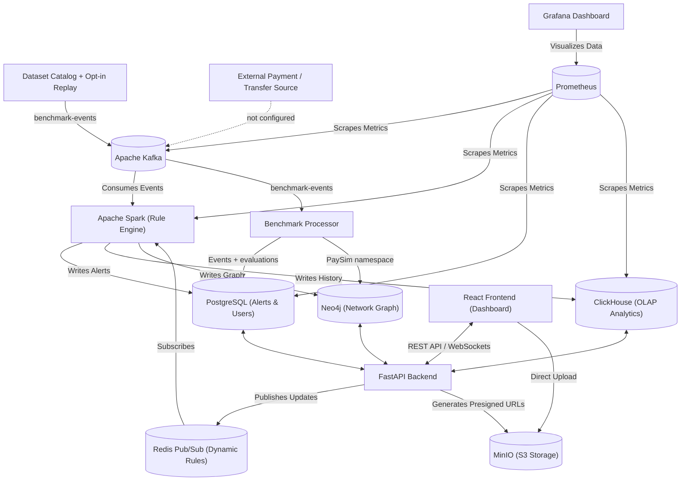

# 🏦 Real-time Banking Data Platform & Fraud Detection System

A real-time banking data platform featuring a comprehensive Fraud Detection Engine, Anti-Money Laundering (AML) analysis, and a Security Dashboard tailored for investigators.

**Data source status:** the opt-in benchmark replay is available. DS1, DS3 and
DS4 have valid local profiles; 1,000-event DS3 and DS4 canaries have passed.
Runtime mock generators, canned API responses and static sample charts remain
removed. See
`docs/dataset-runs/README.md` for the current evidence and gates.

This project is built on a **Big Data / Event-Driven** architecture, utilizing real-time data streaming and multiple specialized databases to achieve high performance.

## ✨ Key Features

1. **🚀 Real-time Fraud Engine**: Processes payment events supplied to Apache Kafka through Spark Structured Streaming.
2. **🧠 XAI (Explainable AI)**: Automatically evaluates Risk Scores and provides transparent, human-readable explanations for flagged transactions (e.g., "Detected circular money transfer loop").
3. **⚙️ Dynamic Rule Management**: Administrators can add, modify alert thresholds, or toggle fraud rules directly from the UI without restarting the system (powered by Redis Pub/Sub).
4. **🌐 KYC 360° View**: A comprehensive customer profile. Integrates Neo4j to visualize the transaction network graph, helping investigators identify complex money laundering rings.
5. **🕵️ Case Investigation**: A Case Management system that allows security investigators to assign tasks, leave investigation notes, and securely upload evidence files via MinIO (S3-compatible).
6. **📊 Analytics & Insights**: Dashboard analytics are backed by the connected data stores; empty states appear until source data is available.
7. **🔒 Enterprise Security**: Implements Network Segmentation (3 isolated tiers), Data Masking for PII (Silver/Gold layers), and Database RBAC.

## 🏗 System Architecture

The platform follows a robust event-driven microservices architecture, secured by **Network Segmentation** (Frontend, Backend, and Data networks):


```mermaid
graph TD
    %% Define Nodes
    Replay["Dataset Catalog + Opt-in Replay"] -->|benchmark-events| Kafka[("Apache Kafka")]
    External["External Payment / Transfer Source"] -.->|not configured| Kafka
    Kafka -->|Consumes Events| Spark["Apache Spark (Rule Engine)"]
    Kafka -->|benchmark-events| Benchmark["Benchmark Processor"]
    
    %% Databases
    Spark -->|Writes Alerts| Postgres[("PostgreSQL (Alerts & Users)")]
    Spark -->|Writes History| ClickHouse[("ClickHouse (OLAP Analytics)")]
    Spark -->|Writes Graph| Neo4j[("Neo4j (Network Graph)")]
    Benchmark -->|Events + evaluations| Postgres
    Benchmark -->|PaySim namespace| Neo4j
    
    %% Backend
    Postgres <--> Backend["FastAPI Backend"]
    ClickHouse <--> Backend
    Neo4j <--> Backend
    
    %% Dynamic Rules
    Backend -->|Publishes Updates| Redis[("Redis Pub/Sub (Dynamic Rules)")]
    Redis -->|Subscribes| Spark
    
    %% Storage
    Backend -->|Generates Presigned URLs| MinIO[("MinIO (S3 Storage)")]
    Frontend["React Frontend (Dashboard)"] <-->|REST API / WebSockets| Backend
    Frontend -->|Direct Upload| MinIO
    
    %% Monitoring
    Prometheus[("Prometheus")] -->|Scrapes Metrics| Kafka
    Prometheus -->|Scrapes Metrics| Spark
    Prometheus -->|Scrapes Metrics| Postgres
    Prometheus -->|Scrapes Metrics| ClickHouse
    Grafana["Grafana Dashboard"] -->|Visualizes Data| Prometheus
```

## 💻 Tech Stack

The system utilizes a modern technology stack fully containerized with Docker.

* **Frontend**: React.js, Recharts (Data Visualization), React-Force-Graph (Network Graph), Lucide Icons.
* **Backend**: FastAPI (Python), Boto3, Redis Pub/Sub.
* **Streaming Engine**: Apache Kafka, Apache Spark (PySpark).
* **Databases & Storage**:
  * **PostgreSQL**: Stores user data, Alerts, Case management state, and Rules.
  * **ClickHouse**: High-performance OLAP Database for transaction history and Analytics.
  * **Neo4j**: Graph Database specialized in querying network relationships (for AML).
  * **Redis**: Caching and Pub/Sub Message Broker for the Rule Engine.
  * **MinIO**: S3-compatible Object Storage for saving evidence files (PDFs/Images).
* **Monitoring & Observability**:
  * **Prometheus**: Time-series database for scraping system metrics (Kafka, Spark, DBs).
  * **Grafana**: Visualization dashboard for infrastructure and application health.
* **Security**: Centralized `.env` secrets management, RBAC for Postgres/ClickHouse, and PySpark-based Data Masking.

## 🚀 Setup & Installation

### 1. Prerequisites
* Docker and Docker Compose installed.
* At least 8GB of RAM (16GB recommended due to running multiple databases and Spark).

### 2. Start the System

Clone the repository and run the following command at the project root directory:

Create `.env` from `.env.example` and fill every credential before starting.
`APP_MODE=integration` is the default: PostgreSQL, Kafka, Redis, Neo4j,
ClickHouse and MinIO must be reachable. API errors are reported instead of
showing sample data. PostgreSQL and dashboard credentials are required for
authentication and alert storage.

```bash
docker compose up -d
```

For local integration testing, Compose builds MinIO Community and `mc` from
pinned upstream source revisions in `docker/minio/Dockerfile`. This replaces
the unavailable public `quay.io/minio/*:latest` images and reuses the existing
`minio_data` volume. MinIO Community is archived and does not receive current
security fixes; **do not use this image for production or real banking data**.
MinIO's API and console bind to localhost only. Change the sample
`MINIO_ROOT_USER` and `MINIO_ROOT_PASSWORD` values in `.env` before storing
anything sensitive.
Production deployments should use a maintained, licensed MinIO AIStor release
or another approved S3-compatible store after reviewing its migration plan.

The initial startup may take a few minutes to pull images and initialize databases. The following containers will be launched:
- `banking_kafka`, `banking_zookeeper`
- `banking_postgres`, `banking_clickhouse`, `banking_neo4j`, `banking_redis`, `banking_minio`
- `banking_spark_master`, `banking_spark_worker`
- `banking_dashboard_backend`, `banking_dashboard_frontend`

*Note: The containers are deployed across 3 isolated Docker networks (`frontend_network`, `backend_network`, `data_network`) for enhanced security.*

### 3. Accessing Services

Once all containers transition to the *Running* state, you can access the following interfaces:

* **Dashboard Web UI**: [http://localhost:5173](http://localhost:5173)
* **Backend API Docs**: [http://localhost:8000/docs](http://localhost:8000/docs)
* **MinIO Console**: [http://localhost:9001](http://localhost:9001)
* **Neo4j Browser**: [http://localhost:7474](http://localhost:7474)
* **Grafana**: [http://localhost:3000](http://localhost:3000)
* **Prometheus**: [http://localhost:9090](http://localhost:9090)

## 📁 Directory Structure

```text
banking_data_platform/
├── dashboard/
│   ├── backend/               # FastAPI Server, APIs, Database Connections
│   │   ├── main.py            # Backend Entry point
│   │   └── sql/               # Init scripts for Postgres, Clickhouse
│   └── frontend/              # React UI Application
│       ├── src/
│       │   ├── components/    # Tabs (Security, Analytics, Rules, KYC...)
│       │   └── index.css      # Custom UI styling
├── datasets/                  # Public dataset catalog, acquisition and profiling
├── kafka/producers/           # Opt-in benchmark dataset replay
├── docker/                    # init.sql scripts for DB startup
├── spark_jobs/                # PySpark Streaming Scripts (Fraud Rule Engine)
└── docker-compose.yml         # Infrastructure configuration
```

## 🛠 Troubleshooting

1. **Cannot connect to MinIO / Upload fails**: Ensure ports `9000` (API) and `9001` (console) are not occupied. The frontend uploads through presigned URLs on the API port `9000`.
2. **No real-time data visible**: Check Kafka logs (`docker logs banking_kafka`) and verify if the Spark Streaming Job is running.
3. **No events visible**: No live payment or transfer source is connected by default. Check `/api/health/live` and `/api/health/ready`. Use the Datasets tab for an explicit benchmark replay; charts remain empty when neither a live source nor a replay run is active.

---
*This project is designed as a Proof of Concept (PoC) for a real-time banking data processing platform utilizing Big Data technologies.*
