# 🏗 System Architecture

> Interactive architecture diagram of the **Real-time Banking Data Platform & Fraud Detection System**.
> Click on any node to jump directly to its source code on GitHub.

---

## Full System Flowchart

```mermaid
flowchart TD

subgraph group_ingestion_streaming["Ingestion & Streaming"]
  node_payment_producer["Payment Producer"]
  node_kafka["Apache Kafka"]
  node_payment_processing["Payment Processing"]
end

subgraph group_detection_aml["Detection & AML"]
  node_fraud_detection["Fraud Detection<br/>[fraud_detection.py]"]
  node_fraud_rules["Fraud Rules<br/>[large_amount.py]"]
  node_risk_scorer["Risk Scoring<br/>[risk_scorer.py]"]
  node_aml_rules["AML Rules<br/>[structuring.py]"]
  node_graph_pipeline["AML Graph Pipeline<br/>[neo4j_pipeline.py]"]
end

subgraph group_data_platform["Data Platform"]
  node_postgres[("PostgreSQL")]
  node_clickhouse[("ClickHouse")]
  node_neo4j[("Neo4j")]
  node_redis[("Redis Pub/Sub")]
  node_minio[("MinIO Storage")]
end

subgraph group_dashboard_ops["Dashboard & Operations"]
  node_backend["FastAPI Backend<br/>[main.py]"]
  node_kafka_client["Kafka Client<br/>[kafka_client.py]"]
  node_auth_api["Auth API<br/>[auth.py]"]
  node_alerts_api["Alerts API<br/>[alerts.py]"]
  node_analytics_api["Analytics API<br/>[analytics.py]"]
  node_graph_api["Graph API<br/>[graph.py]"]
  node_config_api["Rules Config API<br/>[config.py]"]
  node_frontend["React Dashboard<br/>[App.jsx]"]
end

subgraph group_batch_data["Batch Data"]
  node_customer_batch["Customer Batch"]
  node_warehouse_batch["Warehouse Batch"]
  node_airflow["Airflow Pipeline"]
end

node_investigator(("Investigator"))

node_payment_producer -->|"produces events"| node_kafka
node_kafka -->|"delivers events"| node_payment_processing
node_payment_processing -->|"dispatches payments"| node_fraud_detection
node_fraud_detection -->|"evaluates rules"| node_fraud_rules
node_fraud_detection -->|"scores risk"| node_risk_scorer
node_fraud_detection -->|"checks AML"| node_aml_rules
node_fraud_detection -->|"updates graph"| node_graph_pipeline
node_fraud_detection -->|"writes alerts"| node_postgres
node_fraud_detection -->|"writes history"| node_clickhouse
node_graph_pipeline -->|"writes relationships"| node_neo4j
node_graph_pipeline -->|"detects cycles"| node_neo4j
node_backend -->|"starts consumers"| node_kafka_client
node_kafka_client -->|"consumes events"| node_kafka
node_kafka_client -->|"stores alerts"| node_postgres
node_kafka_client -->|"broadcasts events"| node_frontend
node_backend -->|"registers routes"| node_auth_api
node_auth_api -->|"reads users"| node_postgres
node_backend -->|"registers routes"| node_alerts_api
node_alerts_api -->|"reads alerts"| node_postgres
node_backend -->|"registers routes"| node_analytics_api
node_analytics_api -->|"queries analytics"| node_clickhouse
node_backend -->|"registers routes"| node_graph_api
node_graph_api -->|"queries graph"| node_neo4j
node_backend -->|"registers routes"| node_config_api
node_config_api -->|"reads rules"| node_postgres
node_config_api -.->|"publishes updates"| node_redis
node_redis -.->|"updates rules"| node_fraud_detection
node_investigator -->|"reviews alerts"| node_frontend
node_frontend -->|"calls APIs"| node_backend
node_frontend -->|"opens WebSocket"| node_backend
node_airflow -->|"runs pipeline"| node_customer_batch
node_customer_batch -->|"writes silver data"| node_minio
node_customer_batch -->|"loads dimensions"| node_postgres
node_airflow -->|"runs warehouse"| node_warehouse_batch
node_warehouse_batch -->|"reads silver data"| node_minio
node_warehouse_batch -->|"loads warehouse"| node_clickhouse

click node_payment_producer "https://github.com/hquan07/banking_data_platform/blob/main/kafka/producers/payment_producer.py"
click node_payment_processing "https://github.com/hquan07/banking_data_platform/blob/main/streaming/payment_processing.py"
click node_fraud_detection "https://github.com/hquan07/banking_data_platform/blob/main/streaming/fraud_detection.py"
click node_fraud_rules "https://github.com/hquan07/banking_data_platform/blob/main/fraud/rules/large_amount.py"
click node_risk_scorer "https://github.com/hquan07/banking_data_platform/blob/main/fraud/scoring/risk_scorer.py"
click node_aml_rules "https://github.com/hquan07/banking_data_platform/blob/main/aml/rules/structuring.py"
click node_graph_pipeline "https://github.com/hquan07/banking_data_platform/blob/main/aml/graph/neo4j_pipeline.py"
click node_backend "https://github.com/hquan07/banking_data_platform/blob/main/dashboard/backend/main.py"
click node_kafka_client "https://github.com/hquan07/banking_data_platform/blob/main/dashboard/backend/services/kafka_client.py"
click node_auth_api "https://github.com/hquan07/banking_data_platform/blob/main/dashboard/backend/api/auth.py"
click node_alerts_api "https://github.com/hquan07/banking_data_platform/blob/main/dashboard/backend/api/alerts.py"
click node_analytics_api "https://github.com/hquan07/banking_data_platform/blob/main/dashboard/backend/api/analytics.py"
click node_graph_api "https://github.com/hquan07/banking_data_platform/blob/main/dashboard/backend/api/graph.py"
click node_config_api "https://github.com/hquan07/banking_data_platform/blob/main/dashboard/backend/api/config.py"
click node_frontend "https://github.com/hquan07/banking_data_platform/blob/main/dashboard/frontend/src/App.jsx"
click node_customer_batch "https://github.com/hquan07/banking_data_platform/blob/main/batch/customer_pipeline.py"
click node_warehouse_batch "https://github.com/hquan07/banking_data_platform/blob/main/batch/warehouse_pipeline.py"
click node_airflow "https://github.com/hquan07/banking_data_platform/blob/main/airflow/dags/banking_pipeline.py"

classDef toneBlue fill:#dbeafe,stroke:#2563eb,stroke-width:1.5px,color:#172554
classDef toneAmber fill:#fef3c7,stroke:#d97706,stroke-width:1.5px,color:#78350f
classDef toneMint fill:#dcfce7,stroke:#16a34a,stroke-width:1.5px,color:#14532d
classDef toneRose fill:#ffe4e6,stroke:#e11d48,stroke-width:1.5px,color:#881337
classDef toneIndigo fill:#e0e7ff,stroke:#4f46e5,stroke-width:1.5px,color:#312e81

class node_payment_producer,node_kafka,node_payment_processing toneBlue
class node_fraud_detection,node_fraud_rules,node_risk_scorer,node_aml_rules,node_graph_pipeline toneAmber
class node_postgres,node_clickhouse,node_neo4j,node_redis,node_minio toneMint
class node_backend,node_kafka_client,node_auth_api,node_alerts_api,node_analytics_api,node_graph_api,node_config_api,node_frontend toneRose
class node_customer_batch,node_warehouse_batch,node_airflow,node_investigator toneIndigo
```

---

## Component Summary

| Group | Components | Technology |
|-------|-----------|------------|
| **Ingestion & Streaming** | Payment Producer → Kafka → Payment Processing | Python, Kafka |
| **Detection & AML** | Fraud Detection, Rules Engine, Risk Scorer, AML Graph Pipeline | Python, Spark |
| **Data Platform** | PostgreSQL, ClickHouse, Neo4j, Redis, MinIO | Docker containers |
| **Dashboard & Operations** | FastAPI Backend (8 API modules) + React Frontend | Python, React |
| **Batch Data** | Airflow → Customer Pipeline → Warehouse Pipeline | Python, Airflow |

## Color Legend

| Color | Meaning |
|-------|---------|
| 🔵 Blue | Ingestion & Streaming |
| 🟡 Amber | Fraud Detection & AML |
| 🟢 Mint | Databases & Storage |
| 🔴 Rose | Dashboard & API |
| 🟣 Indigo | Batch Processing & Actors |
